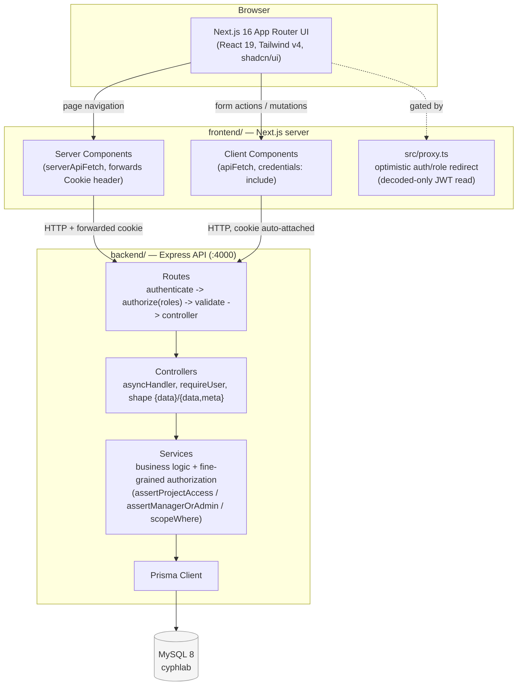
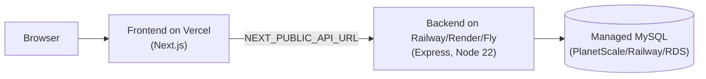

# System Architecture

## Request lifecycle

1. **Auth**: on login, the backend signs a JWT (`sub`, `role`) and sets it as an `httpOnly` cookie named
   `token` (8h expiry, no refresh flow).
2. **Optimistic gate**: `frontend/src/proxy.ts` decodes (does **not** verify) that cookie to redirect
   unauthenticated requests to `/login` and gate `/admin`-prefixed routes to the `ADMIN` role. This is
   UX-only.
3. **Authoritative check**: every backend request re-verifies the JWT signature (`authenticate`
   middleware) and re-checks authorization — coarse-grained via `authorize(...roles)` at the route level,
   fine-grained via service-level helpers that check DB-backed ownership/membership
   (`assertProjectAccess`, `assertManagerOrAdmin`, `scopeWhere`).
4. **Response envelope**: controllers return `{ data }` or `{ data, meta }` for paginated lists; errors
   are `{ error: { message } }`. `frontend/src/lib/api.ts` (`apiFetch` for Client Components,
   `serverApiFetch` for Server Components) unwraps this envelope and throws `ApiError` on failure.
5. **Data layer**: services are the only layer that talks to Prisma; `TaskStatusLog` rows are written
   transactionally alongside any `Task.status` change, forming an append-only audit trail.

## Deployment shape (target)

Not currently deployed — see the root `README.md` "Deployment" section.
