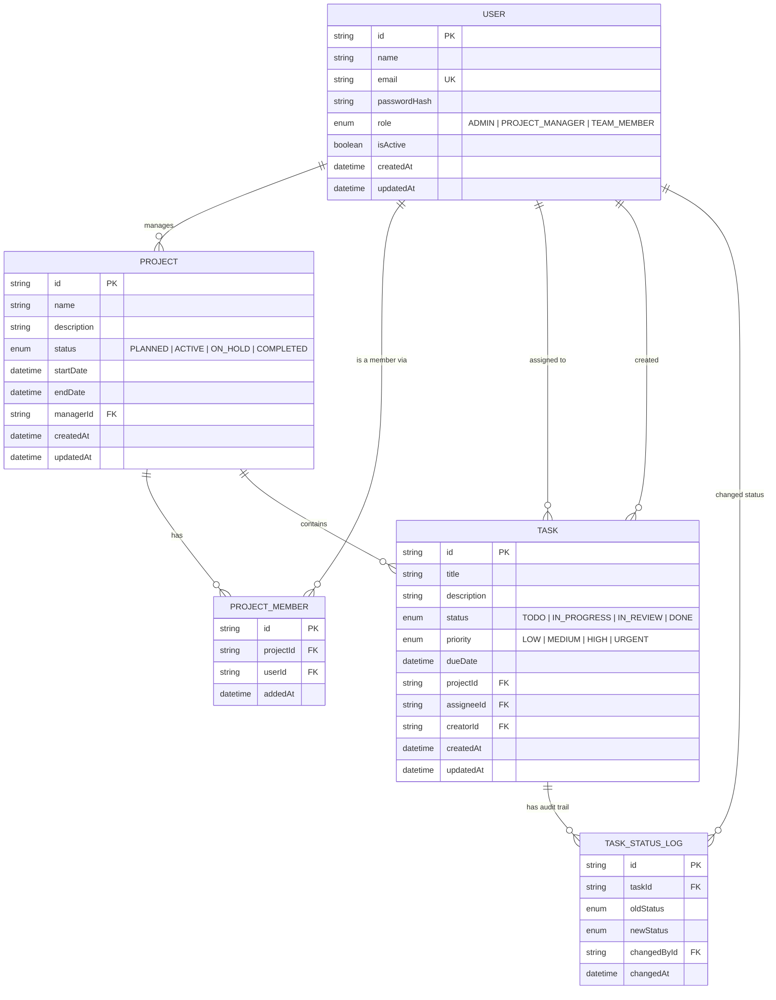

# Entity Relationship Diagram

Generated from `backend/prisma/schema.prisma`. Renders automatically on GitHub.

## Notes

- `ProjectMember` is a join table between `User` and `Project`, unique on `(projectId, userId)` — a user
  can only be added to a given project once. Deleting a project or a user cascades to their memberships.
- `Task.assigneeId` is nullable (a task can be unassigned); `Task.creatorId` is required.
- `TaskStatusLog` is append-only — it is written transactionally alongside every `Task.status` change
  (see `backend/src/services/task.service.ts::updateTask`) and forms an audit trail, never updated or
  deleted directly.
- Deleting a `Project` cascades to its `Task`s and `ProjectMember`s; deleting a `Task` cascades to its
  `TaskStatusLog` entries.
