# Use Case Diagram

Actors and permissions reflect the actual route-level (`authorize(...)`) and service-level
(`assertProjectAccess` / `assertManagerOrAdmin`) authorization checks in the backend — see
`backend/src/routes/*.routes.ts` and `backend/src/services/*.service.ts`.

```mermaid
flowchart LR
    Admin([Admin])
    PM([Project Manager])
    TM([Team Member])

    subgraph Auth["Authentication"]
        UC1(("Register / Log in"))
        UC2(("Log out"))
        UC3(("View own profile"))
    end

    subgraph UserMgmt["User management"]
        UC4(("List all users"))
        UC5(("Change a user's role"))
        UC6(("Activate / deactivate a user"))
    end

    subgraph ProjectMgmt["Project management"]
        UC7(("Create project"))
        UC8(("Edit any project"))
        UC9(("Edit own managed project"))
        UC10(("Delete project"))
        UC11(("View all projects"))
        UC12(("View own / member projects"))
    end

    subgraph MemberMgmt["Team member management"]
        UC13(("Add member to project"))
        UC14(("Remove member from project"))
    end

    subgraph TaskMgmt["Task management"]
        UC15(("Create task"))
        UC16(("Edit any field of a task"))
        UC17(("Delete task"))
        UC18(("View assigned / accessible tasks"))
        UC19(("Update status of own assigned task"))
        UC20(("View task status history"))
    end

    subgraph Dashboard["Dashboard"]
        UC21(("View role-scoped summary stats"))
    end

    Admin --> UC1 & UC2 & UC3
    Admin --> UC4 & UC5 & UC6
    Admin --> UC7 & UC8 & UC10 & UC11
    Admin --> UC13 & UC14
    Admin --> UC15 & UC16 & UC17 & UC18 & UC20
    Admin --> UC21

    PM --> UC1 & UC2 & UC3
    PM --> UC7 & UC9 & UC12
    PM --> UC13 & UC14
    PM --> UC15 & UC16 & UC17 & UC18 & UC20
    PM --> UC21

    TM --> UC1 & UC2 & UC3
    TM --> UC12
    TM --> UC18 & UC19 & UC20
    TM --> UC21
```

## Notes

- **Edit any field of a task** (UC16) vs. **Update status of own assigned task** (UC19): both routes
  are `PATCH /tasks/:id`, but the service layer allow-lists which fields each role may change. A Team
  Member's request is rejected (403) unless it (a) targets a task assigned to them and (b) only touches
  `status`. Admins and the task's Project Manager may change any field.
- **View all projects** (UC11) vs. **View own / member projects** (UC12): both hit the same
  `GET /projects` endpoint; the result set is scoped server-side by `scopeWhere(user)` in
  `project.service.ts` rather than by two different endpoints.
- Project Managers can only exercise project/task/member use cases on projects where they are the
  `managerId` (enforced by `assertManagerOrAdmin`) or where they've been added as a member
  (`assertProjectAccess`).
